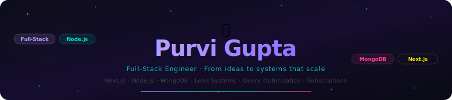
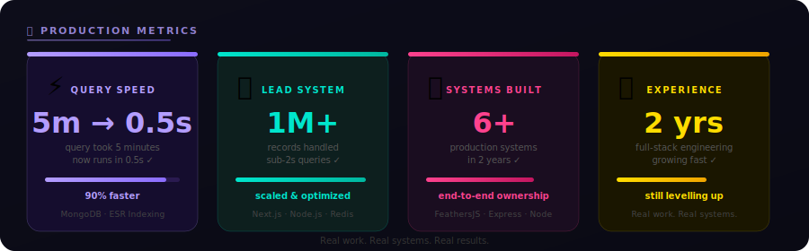
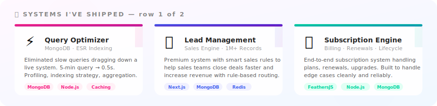
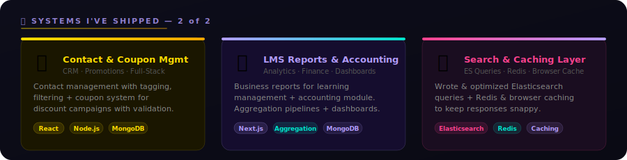

<!-- Colorful Header SVG — commit header.svg to your repo -->
<a href="https://github.com/Purvi-Gupta">
  
</a>

<p align="center">
  <a href="https://readme-typing-svg.demolab.com">
    
  </a>
</p>

<p align="center">
  <a href="https://linkedin.com/in/YOUR_LINKEDIN"></a>
  &#8287;&#8287;&#8287;&#8287;&#8287;
  <a href="https://twitter.com/YOUR_TWITTER"></a>
  &#8287;&#8287;&#8287;&#8287;&#8287;
  <a href="mailto:purvigupta269@gmail.com"></a>
  &#8287;&#8287;&#8287;&#8287;&#8287;
  <a href="https://purvi-gupta.github.io/Portfolio/"></a>
</p>

<p align="center">
  <a href="https://github.com/Purvi-Gupta?tab=repositories&sort=stargazers">
    
  </a>
  <a href="https://github.com/Purvi-Gupta?tab=followers">
    
  </a>
  
</p>

<br/>

<!-- ═══════════════════════════════════════════════════════════════ -->
<!-- ABOUT -->
<!-- ═══════════════════════════════════════════════════════════════ -->

<details open>
<summary><h2>🌸 About Me</h2></summary>

```yaml
name:     Purvi Gupta
role:     Full-Stack Engineer
journey:  2 years · front-end to back-end to systems that scale

currently building:
  - Lead management systems handling 1M+ records
  - Subscription engines with clean lifecycle logic
  - Query pipelines that go from painfully slow → fast
  - Sales rule engines that help teams close more deals

stack:    [Next.js, React, Node.js, MongoDB, FeathersJS, Redis, Elasticsearch]
fun_fact: "I paint when I'm not debugging aggregation pipelines 🎨"
```

</details>

<!-- ═══════════════════════════════════════════════════════════════ -->
<!-- METRICS DASHBOARD -->
<!-- ═══════════════════════════════════════════════════════════════ -->

<details open>
<summary><h2>📡 Production Metrics</h2></summary>

<br/>

<a href="metrics.svg">
  
</a>

</details>

<!-- ═══════════════════════════════════════════════════════════════ -->
<!-- PROJECTS -->
<!-- ═══════════════════════════════════════════════════════════════ -->

<details open>
<summary><h2>🏆 Systems I've Shipped</h2></summary>

<sub>Real systems. Real data. Real users.</sub>

<br/><br/>

<a href="https://github.com/Purvi-Gupta">
  
</a>

<a href="https://github.com/Purvi-Gupta">
  
</a>

</details>

<!-- ═══════════════════════════════════════════════════════════════ -->
<!-- TECH STACK -->
<!-- ═══════════════════════════════════════════════════════════════ -->

<details>
<summary><h2>🛠️ Tech Stack</h2></summary>

<br/>

<p align="center">
  &#8287;
  &#8287;
  &#8287;
  &#8287;
  &#8287;
  &#8287;
  &#8287;
  &#8287;
  &#8287;
  &#8287;
  &#8287;
  &#8287;
  &#8287;
  
</p>

<br/>

**Languages & Frameworks:** Next.js · React · Node.js · Express.js · FeathersJS · TypeScript · JavaScript

**Databases & Storage:** MongoDB · Mongoose · Redis · Browser Caching · Elasticsearch queries

**Specialties:** DB query optimization · Aggregation pipelines · Subscription systems · Lead management · Sales rule engines · LMS reports · Coupon & contact systems

</details>

<!-- ═══════════════════════════════════════════════════════════════ -->
<!-- GITHUB STATS -->
<!-- ═══════════════════════════════════════════════════════════════ -->

<details open>
<summary><h2>📊 GitHub Stats</h2></summary>

<br/>

<p align="center">
  <a href="https://github.com/DenverCoder1/github-readme-streak-stats">
    
  </a>
</p>

<p align="center">
  <a href="https://github.com/anuraghazra/github-readme-stats">
    
  </a>
  <a href="https://github.com/anuraghazra/github-readme-stats">
    
  </a>
</p>

<sub>⚠️ GitHub only counts public activity here. My real work — lead systems, query optimization, subscriptions — lives in private repos.</sub>

<br/>

<p align="center">
  <a href="https://github.com/ashutosh00710/github-readme-activity-graph">
    
  </a>
</p>

<p align="center">
  <picture>
    <source media="(prefers-color-scheme: dark)" srcset="https://raw.githubusercontent.com/Purvi-Gupta/Purvi-Gupta/output/github-snake-dark.svg" />
    <source media="(prefers-color-scheme: light)" srcset="https://raw.githubusercontent.com/Purvi-Gupta/Purvi-Gupta/output/github-snake.svg" />
    
  </picture>
</p>

</details>

<!-- ═══════════════════════════════════════════════════════════════ -->
<!-- ENGINEERING PHILOSOPHY -->
<!-- ═══════════════════════════════════════════════════════════════ -->

<details>
<summary><h2>💡 How I Think About Engineering</h2></summary>

<br/>

```javascript
const purvi = {

  performance: {
    belief: "Slow is a bug. Measure it. Fix it. Prove it.",
    proof:  "5M record queries: was slow, now 0.5s. Profiled, indexed, done."
  },

  systems: {
    belief: "Understand the data first. The code follows.",
    proof:  "Lead systems, subscriptions, coupons — each designed for the real use case."
  },

  growth: {
    belief: "Every production system teaches you something training never could.",
    proof:  "2 years in. Still learning. Getting better at both."
  },

  craft: {
    belief: "Clean, readable code is a kindness to your future self.",
    proof:  "I also paint. Composition matters everywhere 🎨"
  }

};
```

</details>

<!-- ═══════════════════════════════════════════════════════════════ -->
<!-- FOOTER -->
<!-- ═══════════════════════════════════════════════════════════════ -->

<br/>

<p align="center">
  
</p>

<p align="center">
  <sub>Got an interesting problem? → <a href="mailto:purvigupta269@gmail.com"><code>let's talk</code></a> · <a href="https://purvi-gupta.github.io/Portfolio/"><code>see my work</code></a></sub>
</p>
